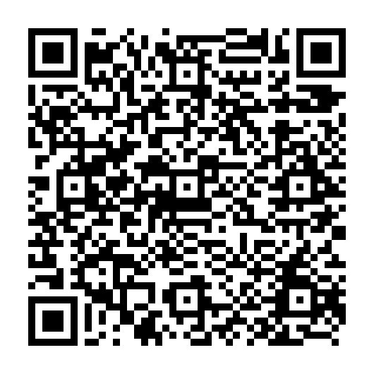

# Bitcoin timestamp document

Creates a bitcoin zero value transaction with metadata. The metadata contains document hash and owner name.

How to run:
```bash
python3 stamp.py --private-key=925hizLyDqen4gsCFeCXFWLXPC7BGQRR4ngA76Usjgb6ABiz59j --file=picture.png --name="yulia tsareva" --network=testnet
QR code for tx '6f873f255d6649daf3d8f83b454ff59793c4c46db631485d6f2c4f53d17ffc56' was saved to file 6f873.png
```



To decrypt data stored in transacation:
1. Scan QR code
2. Open the link> E.g. https://www.blockchain.com/en/btc-testnet/tx/6f873f255d6649daf3d8f83b454ff59793c4c46db631485d6f2c4f53d17ffc56
3. Find Outputs section
4. Get Pkscript hex-string
5. Run decrypt script:
```bash
python3 decrypt.py --pkscript cf89a9f87fe17438bfc10b98c40d6d590948df0a0e943555fda992171d60376d79756c69612074736172657661
Document hash: cf89a9f87fe17438bfc10b98c40d6d590948df0a0e943555fda992171d60376d
Author name: yulia tsareva
```


